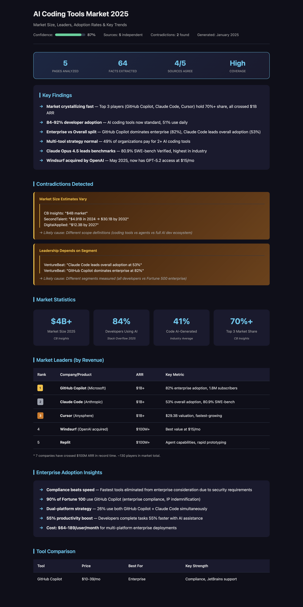

<p align="center">
  
</p>

<h1 align="center">Researching Web</h1>

<p align="center">
  <strong>Turn any question into a research report with confidence scores, contradiction detection, and source attribution.</strong>
</p>

<p align="center">
  <a href="#features">Features</a> •
  <a href="#demo">Demo</a> •
  <a href="#installation">Install</a> •
  <a href="#how-it-works">How It Works</a> •
  <a href="#examples">Examples</a>
</p>

<p align="center">
  
  
  
  
</p>

---

## Why This Exists

Most AI assistants give you answers. This skill gives you **researched insights** with:

| Traditional AI | Researching Web |
|----------------|-----------------|
| Single response | Multi-source synthesis |
| "Trust me" | Confidence score with breakdown |
| Hidden sources | Full attribution + scoring |
| Ignores conflicts | **Detects contradictions** |
| Text dump | Beautiful HTML reports |

---

## Features

- **Hybrid Search** — Combines Exa semantic search + Tabstack for comprehensive coverage
- **Parallel Extraction** — Fetches 5+ sources simultaneously for speed
- **Contradiction Detection** — Finds and explains conflicting information between sources
- **Confidence Scoring** — Transparent breakdown: consensus, authority, freshness
- **Research Depth Stats** — Shows pages analyzed, facts extracted, coverage level
- **Zero Friction** — Auto-selects best output format, no questions asked
- **Beautiful HTML Reports** — Dark/light theme, responsive, screenshot-worthy

---

## Demo

**Terminal output:**

<p align="center">
  
</p>

**Generated HTML report:**

<p align="center">
  
</p>

<details>
<summary><strong>See full terminal output</strong></summary>

```
══════════════════════════════════════════
   RESEARCHING: "AI coding tools market 2026"
══════════════════════════════════════════
[■■□□□□] Search: Exa 8 | Tabstack 5 → 10 unique

[■■■□□□] Scoring: cbinsights.com (90), venturebeat.com (85)...
         Selected: 5 sources above threshold

[■■■■□□] Extracting (parallel)...
         ✓ cbinsights.com
         ✓ venturebeat.com
         ✓ digitalapplied.com
         ✓ index.dev
         ✓ secondtalent.com

[■■■■■□] Synthesizing + Verifying...

⚠️ CONTRADICTION DETECTED:
   CB Insights: "Market size $4B"
   SecondTalent: "Market $4.91B in 2024"
   → Likely cause: different scope definitions

[■■■■■■] Confidence: 87%
         ├─ Consensus: 4/5 agree
         ├─ Top source: 90 (CB Insights)
         ├─ Freshness: 5/5 from 2024-2026
         └─ Contradictions: 2 found

📊 RESEARCH DEPTH
   Pages analyzed: 5 | Facts extracted: 64
   Sources: 5 (1 premium, 1 news, 3 industry)
   Coverage: High
══════════════════════════════════════════
✓ READY: insight-ai-coding-market-2026.html
```

</details>

---

## Installation

This is a **Claude Code skill**. To install:

```bash
# Clone to your skills directory
git clone https://github.com/vasilievyakov/researching-web-skill.git \
  ~/.claude/skills/researching-web
```

### Requirements

You need these MCP servers configured in Claude Code:

| MCP Server | Purpose | Required |
|------------|---------|----------|
| [Exa](https://exa.ai) | Semantic web search | Yes |
| [Tabstack](https://tabstack.ai) | Content extraction | Recommended |

### Configure Claude Code

For the local npm servers below, install Node.js 20+ (which includes `npx`)
and obtain an API key from each service you want to use.

Run these commands in your terminal, replacing the placeholder keys:

```bash
claude mcp add --transport stdio --scope user exa \
  --env EXA_API_KEY=your-exa-api-key -- npx -y exa-mcp-server

# Optional: add Tabstack for content extraction
claude mcp add --transport stdio --scope user tabstack \
  --env TABSTACK_API_KEY=your-tabstack-api-key -- npx -y @tabstack/mcp
```

`--scope user` makes the servers available across all your Claude Code projects.
The npm packages are [`exa-mcp-server`](https://www.npmjs.com/package/exa-mcp-server)
and [`@tabstack/mcp`](https://www.npmjs.com/package/@tabstack/mcp).

Verify the connections:

```bash
claude mcp list
```

Start a new Claude Code session and open `/mcp` to check that `exa` (and
`tabstack`, if added) is connected and exposes its tools. If a connection fails,
check the API key and that Node.js and `npx` are available in your terminal.

See the [Claude Code MCP setup documentation](https://code.claude.com/docs/en/mcp)
for configuration scopes and troubleshooting.

<details>
<summary><strong>Equivalent project-scoped .mcp.json example</strong></summary>

As an alternative to the user-scoped commands above, save this configuration
as `.mcp.json` in your project root. Replace the placeholder keys locally;
do not commit real API keys. Omit `tabstack` if you only want Exa.

```json
{
  "mcpServers": {
    "exa": {
      "type": "stdio",
      "command": "npx",
      "args": ["-y", "exa-mcp-server"],
      "env": { "EXA_API_KEY": "your-key" }
    },
    "tabstack": {
      "type": "stdio",
      "command": "npx",
      "args": ["-y", "@tabstack/mcp"],
      "env": { "TABSTACK_API_KEY": "your-key" }
    }
  }
}
```

</details>

---

## How It Works

```
┌─────────────────────────────────────────────────────────────────┐
│  Query                                                          │
│  "Compare React vs Vue for enterprise 2026"                     │
└─────────────────┬───────────────────────────────────────────────┘
                  │
                  ▼
┌─────────────────────────────────────────────────────────────────┐
│  1. CLASSIFY                                                    │
│  Type: Comparison → 5+ sources, hybrid search                   │
└─────────────────┬───────────────────────────────────────────────┘
                  │
                  ▼
┌─────────────────────────────────────────────────────────────────┐
│  2. SEARCH (parallel)                                           │
│  ┌──────────────┐    ┌──────────────┐                          │
│  │ Exa Semantic │    │  Tabstack    │  → Dedupe → 10 unique    │
│  │   8 results  │    │  5 results   │                          │
│  └──────────────┘    └──────────────┘                          │
└─────────────────┬───────────────────────────────────────────────┘
                  │
                  ▼
┌─────────────────────────────────────────────────────────────────┐
│  3. SCORE & SELECT                                              │
│  official docs (90) > research (80) > blogs (60) > forums (40) │
│  → Top 5 sources selected                                       │
└─────────────────┬───────────────────────────────────────────────┘
                  │
                  ▼
┌─────────────────────────────────────────────────────────────────┐
│  4. EXTRACT (parallel)                                          │
│  All 5 sources extracted simultaneously via Tabstack            │
└─────────────────┬───────────────────────────────────────────────┘
                  │
                  ▼
┌─────────────────────────────────────────────────────────────────┐
│  5. SYNTHESIZE                                                  │
│  Merge facts, dedupe, identify consensus vs disputed            │
└─────────────────┬───────────────────────────────────────────────┘
                  │
                  ▼
┌─────────────────────────────────────────────────────────────────┐
│  6. VERIFY                                                      │
│  ⚠️ Detect contradictions between sources                       │
│  ⚠️ Flag single-source claims as "unverified"                   │
│  → Calculate confidence score                                   │
└─────────────────┬───────────────────────────────────────────────┘
                  │
                  ▼
┌─────────────────────────────────────────────────────────────────┐
│  7. OUTPUT                                                      │
│  Auto-select format → Generate HTML report                      │
│  insight-react-vs-vue-2026.html                                 │
└─────────────────────────────────────────────────────────────────┘
```

---

## Examples

### Query Types & Output

| Query Type | Example | Auto-Output |
|------------|---------|-------------|
| Comparison | "Claude Code vs Cursor vs Windsurf" | Comparison table HTML |
| Fact | "What is Claude's context window?" | Quick answer in chat |
| Overview | "AI coding tools market 2026" | Full HTML report |
| How-to | "How to set up MCP servers" | Step-by-step guide |

### Sample Reports

- [AI Coding Tools Market 2026](examples/insight-ai-coding-market-2026.html) — Market analysis with contradiction detection
- [Claude Code vs Cursor vs Windsurf](examples/insight-claude-vs-cursor-vs-windsurf.html) — Tool comparison

---

## Comparison vs Alternatives

| Feature | This Skill | ChatGPT Search | Perplexity |
|---------|------------|----------------|------------|
| Multi-source synthesis | ✅ 5+ sources | ✅ | ✅ |
| Source scoring | ✅ Transparent | ❌ Hidden | ⚠️ Partial |
| Contradiction detection | ✅ **Unique** | ❌ | ❌ |
| Confidence breakdown | ✅ Detailed | ❌ | ⚠️ Simple |
| HTML report output | ✅ Beautiful | ❌ | ❌ |
| Research depth stats | ✅ Pages/facts | ❌ | ❌ |
| Customizable | ✅ Edit skill | ❌ | ❌ |
| Works offline* | ✅ With local MCP | ❌ | ❌ |

*With self-hosted search MCP servers

---

## Configuration

The skill auto-detects query type and selects the best approach:

| Query Signal | Sources | Strategy |
|--------------|---------|----------|
| "vs", "compare" | 5+ | Hybrid search, comparison table |
| "what is", "when" | 1-2 | Exa only, quick answer |
| "how to" | 2-3 | Exa only, step-by-step |
| Complex topic | 3-5 | Hybrid, full report |
| Code/API question | 1-2 | `get_code_context_exa` |

---

## Output Formats

### HTML Report (default for complex queries)

- Responsive dark/light theme
- Confidence gauge with breakdown
- Contradiction boxes with explanations
- Research depth visualization
- Clickable source links with scores

### Quick Summary (for simple questions)

- Answer directly in chat
- Sources listed with scores
- No file generated

---

## Learnings

### Why Contradiction Detection?

Most AI search tools hide conflicting information — they pick one answer and present it as truth. But real research often reveals disagreements between sources.

**Example:** When researching "AI coding tools market size", we found:
- CB Insights: "$4B market"
- SecondTalent: "$4.91B market"

Without contradiction detection, you'd get one number and trust it. With it, you see both — and understand *why* they differ (scope definitions). This is the difference between an answer and an insight.

### From 556 to 127 Lines

The first version of this skill was 556 lines — detailed explanations, scoring tables, step-by-step instructions.

**The problem:** Claude is already smart. Over-explaining makes the skill slower and harder to maintain.

**The fix:** Applied "Andrej Karpathy's rule" — trust the model, remove everything it already knows. Keep only:
- What tools to use (MCP names)
- What output format to show
- What makes this skill unique (contradictions, confidence)

Result: **127 lines** that work better than 556.

---

## Contributing

Contributions welcome! See [CONTRIBUTING.md](CONTRIBUTING.md).

**Ideas for improvement:**
- [ ] Add more output formats (Markdown, PDF)
- [ ] Support more MCP search providers
- [ ] Multilingual query support
- [ ] Custom confidence thresholds

---

## License

MIT License — see [LICENSE](LICENSE) for details.

---

<p align="center">
  <sub>Built with Claude Code • Powered by Exa + Tabstack MCP</sub>
</p>
